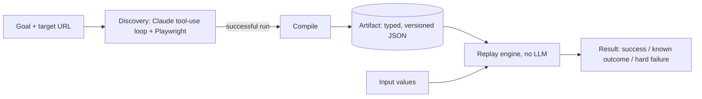

# Rewind

**Record a browser workflow once with an LLM, then replay it forever without one.**

Many back-office systems (core banking screens, servicing tools, admin consoles) have no API, so the only way in is to drive the UI like a person would. Letting an LLM operate the UI on every request works, but it is slow, costs money on every call, can behave differently each time, and sends every customer's data through a model.

Rewind splits the problem in two:

1. **Discovery.** A Claude agent, driving a real browser through Playwright, figures out how to complete a task once (for example, apply for a loan).
2. **Replay.** That successful run is compiled into a typed, versioned **artifact**. A deterministic replay engine executes the artifact on every future call with different input values, no LLM involved, and reports back a structured result.

Built and tested against [ParaBank](https://parabank.parasoft.com), a banking demo app, either the public site or a local Docker copy. Three capabilities are recorded so far: `login`, `request_loan`, and `get_account_overview`.

## Results

Measured on the `request_loan` capability (`python -m src.benchmark`, 2026-09-20, headless Chromium, `claude-sonnet-5`):

| | Discovery (LLM loop) | Replay (no LLM) |
|---|---|---|
| Runs | 3 | 20 |
| Success rate | 100% | 100% |
| Time for the loan step, median | 13.1 s (range 12.5 to 13.3) | **0.41 s** (range 0.39 to 0.57) |
| Time including login, median | n/a | 1.54 s (p95 1.87) |
| LLM API calls per run | 6 | **0** (measured, see below) |
| Tokens per run (in / out) | ~34,400 / ~1,000 | 0 / 0 |
| Est. cost per run | ~$0.08 | **$0** |

- Replay is about **32x faster** than discovery for the same step, and its timing is nearly constant.
- The benchmark also found a bottleneck in replay itself: it slept a fixed 1 s after every step, so the loan step took 3.7 s. Replacing that with a wait for the page state replay actually needs cut it to 0.41 s.
- "0 LLM calls" is measured, not assumed: the benchmark instruments the Anthropic client during replay and counts calls.
- Cost uses Claude Sonnet 5 list pricing ($2 input / $10 output per 1M tokens).
- Caveats: discovery is only 3 runs, and everything was measured over the internet against the public demo app (a local Docker copy will give different timings). Runs are paced 8 s apart (`--delay`) because the demo site's Cloudflare rate limiter temporarily banned a faster burst during development. Raw data: [`benchmarks/results.json`](benchmarks/results.json).

## How it works



- **The agent observes the page as an accessibility tree**, not screenshots or raw HTML, so it works on legacy markup with no test IDs. Where the tree alone isn't enough (unlabeled form fields), the observation is augmented with real `id`/`name` attributes from the DOM.
- **The artifact is a Pydantic model** (`src/schema.py`): ordered steps, each with a locator that carries a fallback chain and the reasoning for choosing it, `{placeholder}` values for inputs, declared inputs/outputs, a success checkpoint, and known alternate outcomes. It is decoupled from the raw LLM transcript.
- **Replay is deliberately dull.** Placeholder substitution is a plain string swap, locators are resolved with the same selector logic discovery used, and the final page is classified as `success`, `known_outcome`, or `hard_failure` (with the failing step, what was expected, and what was observed). A denied loan is a normal result, not a failure.
- **Safety is enforced where actions execute**, not in the model's reasoning: a domain/route/action allowlist, a confirmation gate for risky actions (large loan amounts), and secret redaction across everything written to disk.
- **Human handoff:** when discovery gets stuck, replay fails, or a risky action needs approval, the run pauses on the *same live browser session*, a person takes over, and the run resumes.

More detail, including real bugs found along the way, is in [`REPORT.md`](REPORT.md).

## Quick start

```bash
python3 -m venv .venv
source .venv/bin/activate
pip install -r requirements.txt
playwright install chromium
```

**Run ParaBank locally (recommended).** The public demo wipes its database every so often, which deletes any account you register and makes runs flaky. Its official Docker image gives you a stable copy with a seeded demo user, so there's nothing to register:

```bash
docker run -d --name parabank --platform linux/amd64 -p 8080:8080 parasoft/parabank
```

The first request builds the demo data, which takes a minute or two (the image is `amd64`, so it runs under emulation on Apple Silicon). After that, `http://localhost:8080/parabank` is ready.

Copy `.env.example` to `.env` and fill it in. For the local copy:

```
ANTHROPIC_API_KEY=          # only needed for discovery and the benchmark's discovery runs
PARABANK_BASE_URL=http://localhost:8080/parabank
PARABANK_USERNAME=john
PARABANK_PASSWORD=demo
PARABANK_ACCOUNT_ID=12345
```

To use the public demo instead, leave `PARABANK_BASE_URL` empty and register a throwaway account at `https://parabank.parasoft.com/parabank/register.htm` (fake data only). If login suddenly fails there, the database reset: register again and update `.env`.

Artifacts always record the public URL, so they work with either. `PARABANK_BASE_URL` only decides which instance a run drives.

**Replay the included artifacts (no API key needed):**

```bash
python -m src.replay.run --capability request_loan \
    --param loan_amount=100 --param down_payment=10 --param from_account_id=<your account>
```

This logs in using the `login` artifact and submits the loan request using the `request_loan` artifact in the same browser session, then prints a structured result:

```
call 0 (login): status=success outputs={} outcome_id=None
call 1 (request_loan): status=success outputs={'status': 'Approved'} outcome_id=None
```

**Record a capability yourself (needs `ANTHROPIC_API_KEY`):**

```bash
python -m src.discovery.run --capability login
python -m src.discovery.run --capability request_loan
```

**Reproduce the benchmark:**

```bash
python -m src.benchmark --discoveries 3 --replays 20
```

Both `run` commands open a visible browser by default so a human can step in during a handoff. Pass `--headless` to hide the window and `--no-escalation` to disable pausing entirely. Tests: `python -m pytest tests/ -q`.

## Use it from an AI agent (MCP)

`src/mcp_server.py` publishes every recorded capability as a typed [MCP](https://modelcontextprotocol.io) tool, so any MCP-capable agent can call `request_loan(loan_amount, down_payment, from_account_id)` like a function. The tool list is generated from the artifacts in `artifacts/`, so recording a new capability adds a new tool.

To connect it to Claude Code, from the repo root:

```bash
claude mcp add rewind -- .venv/bin/python -m src.mcp_server
```

Any other MCP client works the same way: run `python -m src.mcp_server` from the repo root over stdio. The server reads its login and `PARABANK_BASE_URL` from the repo's `.env`, so it targets the same instance as the CLI. With the artifacts in this repo it exposes two tools: `request_loan` and `get_account_overview` (no inputs; returns every account with its balance and the total).

Design choices:

- **The agent never sees credentials.** Login runs server-side from `.env`; the agent only supplies the capability's own inputs.
- **Risky calls are refused, not run.** A loan above the auto-approval limit returns `needs_human_approval`, because nobody is at a terminal to confirm it.
- **Failures are described, not dumped.** A failed call tells the agent which step failed and what was expected. The observed page text stays in local logs under `runs/`, since it can contain customer data.
- **One browser at a time.** Calls are serialized; each gets a fresh headless browser and session.

## Project structure

```
src/
  schema.py            artifact schema (Artifact, Step, Locator, Condition, ...)
  discovery/           Claude tool-use loop, browser tools, compile-to-artifact
  replay/              deterministic execution: locators, checkpoint, extraction, engine
  safety/              allowlist, risk classification, redaction
  escalation/          human handoff
  observability/       structured run logs and screenshots
  config.py            which ParaBank instance to drive (PARABANK_BASE_URL)
  mcp_server.py        MCP server exposing recorded capabilities as agent tools
  benchmark.py         discovery vs replay benchmark
artifacts/             saved capability artifacts (JSON)
benchmarks/            benchmark results
evidence/              logs and screenshots from real discovery and replay runs
```

## Limitations and roadmap

Honest list of what this is not yet:

- Only tested against ParaBank, with three capabilities (login, request loan, account overview).
- No retry tier: a transient failure (including a rate limit from the demo site) is an immediate hard failure with diagnostics, not a retried step.
- Output extraction is schema-driven (an `extract` rule per output: a regex or a table's rows), but the rules are written by hand against the page markup, not discovered by Claude. `request_loan` still reads its outputs through a small code registry (`src/replay/extractors.py`) until it is migrated.
- `get_account_overview` returns every account, so an account with many rows makes a large tool result for an agent. There is no paging or limit yet.
- Secret redaction infers sensitive fields from parameter names; there is no per-field sensitivity flag in the schema yet.
- The recorded loan flow uses the default funding account; `from_account_id` is declared as an input but the steps don't select it yet.

Next: retry with backoff, CI that runs the tests and a replay against the ParaBank Docker image, moving `request_loan`'s outputs into its artifact, more capabilities (transfer funds, find transactions), and a second app variant to demonstrate artifact reuse across similar systems.
