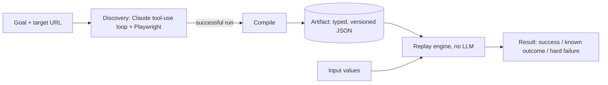

# Rewind

**Record a browser workflow once with an LLM, then replay it forever without one.**

Many back-office systems (core banking screens, servicing tools, admin consoles) have no API, so the only way in is to drive the UI like a person would. Letting an LLM operate the UI on every request works, but it is slow, costs money on every call, can behave differently each time, and sends every customer's data through a model.

Rewind splits the problem in two:

1. **Discovery.** A Claude agent, driving a real browser through Playwright, figures out how to complete a task once (for example, apply for a loan).
2. **Replay.** That successful run is compiled into a typed, versioned **artifact**. A deterministic replay engine executes the artifact on every future call with different input values, no LLM involved, and reports back a structured result.

Built and tested against [ParaBank](https://parabank.parasoft.com), a public banking demo app.

## Results

Measured on the `request_loan` capability (`python -m src.benchmark`, 2026-09-20, headless Chromium, `claude-sonnet-5`):

| | Discovery (LLM loop) | Replay (no LLM) |
|---|---|---|
| Runs | 3 | 20 |
| Success rate | 100% | 100% |
| Time for the loan step, median | 14.1 s (range 11.5 to 19.2) | **3.7 s** (range 3.70 to 3.74) |
| Time including login, median | n/a | 9.05 s (p95 9.22) |
| LLM API calls per run | 6 | **0** (measured, see below) |
| Tokens per run (in / out) | ~29,200 / ~1,100 | 0 / 0 |
| Est. cost per run | ~$0.07 | **$0** |

- Replay is about **3.8x faster** than discovery for the same step, and its timing is nearly constant.
- "0 LLM calls" is measured, not assumed: the benchmark instruments the Anthropic client during replay and counts calls.
- Cost uses Claude Sonnet 5 list pricing ($2 input / $10 output per 1M tokens).
- Caveats: discovery is only 3 runs, everything ran over the internet against a public demo app, and replay currently waits a fixed 1 s after every step, which is most of its 3.7 s (see Roadmap). Raw data: [`benchmarks/results.json`](benchmarks/results.json).

## How it works



- **The agent observes the page as an accessibility tree**, not screenshots or raw HTML, so it works on legacy markup with no test IDs. Where the tree alone isn't enough (unlabeled form fields), the observation is augmented with real `id`/`name` attributes from the DOM.
- **The artifact is a Pydantic model** (`src/schema.py`): ordered steps, each with a locator that carries a fallback chain and the reasoning for choosing it, `{placeholder}` values for inputs, declared inputs/outputs, a success checkpoint, and known alternate outcomes. It is decoupled from the raw LLM transcript.
- **Replay is deliberately dull.** Placeholder substitution is a plain string swap, locators are resolved with the same selector logic discovery used, and the final page is classified as `success`, `known_outcome`, or `hard_failure` (with the failing step, what was expected, and what was observed). A denied loan is a normal result, not a failure.
- **Safety is enforced where actions execute**, not in the model's reasoning: a domain/route/action allowlist, a confirmation gate for risky actions (large loan amounts), and secret redaction across everything written to disk.
- **Human handoff:** when discovery gets stuck, replay fails, or a risky action needs approval, the run pauses on the *same live browser session*, a person takes over, and the run resumes.

More detail, including real bugs found along the way, is in [`REPORT.md`](REPORT.md).

## Quick start

```bash
python3 -m venv .venv
source .venv/bin/activate
pip install -r requirements.txt
playwright install chromium
```

Copy `.env.example` to `.env` and fill it in:

```
ANTHROPIC_API_KEY=          # only needed for discovery and the benchmark's discovery runs
PARABANK_USERNAME=
PARABANK_PASSWORD=
PARABANK_ACCOUNT_ID=        # the account number shown on Accounts Overview
```

Register a throwaway ParaBank account at `https://parabank.parasoft.com/parabank/register.htm` (fake data only). The demo database resets periodically, so if login suddenly fails, re-register and update `.env`.

**Replay the included artifacts (no API key needed):**

```bash
python -m src.replay.run --capability request_loan \
    --param loan_amount=100 --param down_payment=10 --param from_account_id=<your account>
```

This logs in using the `login` artifact and submits the loan request using the `request_loan` artifact in the same browser session, then prints a structured result:

```
call 0 (login): status=success outputs={} outcome_id=None
call 1 (request_loan): status=success outputs={'status': 'Approved'} outcome_id=None
```

**Record a capability yourself (needs `ANTHROPIC_API_KEY`):**

```bash
python -m src.discovery.run --capability login
python -m src.discovery.run --capability request_loan
```

**Reproduce the benchmark:**

```bash
python -m src.benchmark --discoveries 3 --replays 20
```

Both `run` commands open a visible browser by default so a human can step in during a handoff. Pass `--headless` to hide the window and `--no-escalation` to disable pausing entirely. Tests: `python -m pytest tests/ -q`.

## Project structure

```
src/
  schema.py            artifact schema (Artifact, Step, Locator, Condition, ...)
  discovery/           Claude tool-use loop, browser tools, compile-to-artifact
  replay/              deterministic execution: locators, checkpoint, extraction, engine
  safety/              allowlist, risk classification, redaction
  escalation/          human handoff
  observability/       structured run logs and screenshots
  benchmark.py         discovery vs replay benchmark
artifacts/             saved capability artifacts (JSON)
benchmarks/            benchmark results
evidence/              logs and screenshots from real discovery and replay runs
```

## Limitations and roadmap

Honest list of what this is not yet:

- Only tested against ParaBank, with two capabilities (login, request loan).
- No retry tier: a transient failure is an immediate hard failure with diagnostics, not a retried step.
- Replay waits a fixed 1 s after every step. Waiting on the actual expected page change would cut replay time substantially.
- Output extraction lives in a small code registry (`src/replay/extractors.py`) rather than in the artifact schema.
- Secret redaction infers sensitive fields from parameter names; there is no per-field sensitivity flag in the schema yet.
- The recorded loan flow uses the default funding account; `from_account_id` is declared as an input but the steps don't select it yet.

Next: an MCP server so any AI agent can call recorded capabilities as tools, unit tests with CI against a local mock app, and a second app variant to demonstrate artifact reuse across similar systems.
